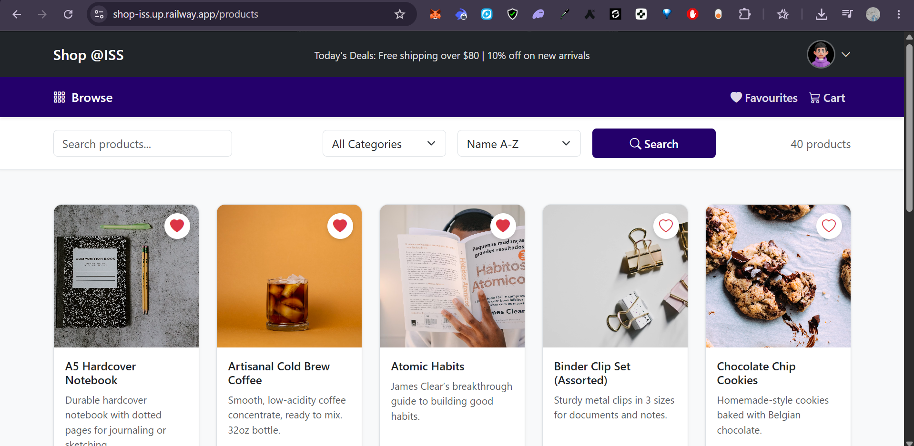
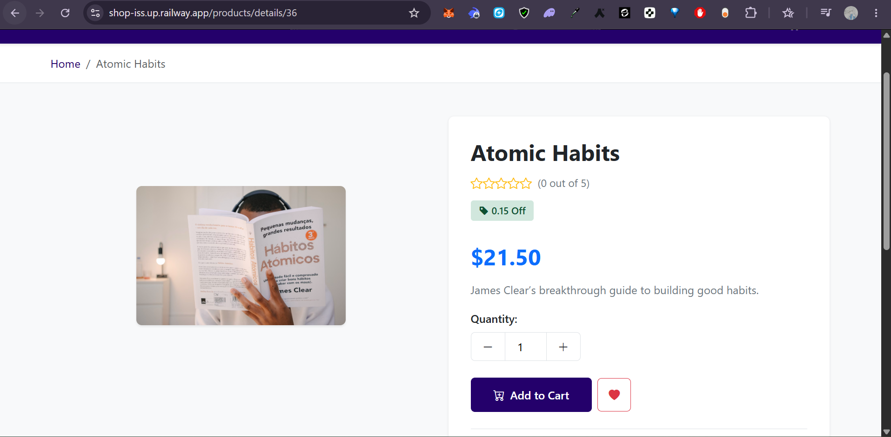
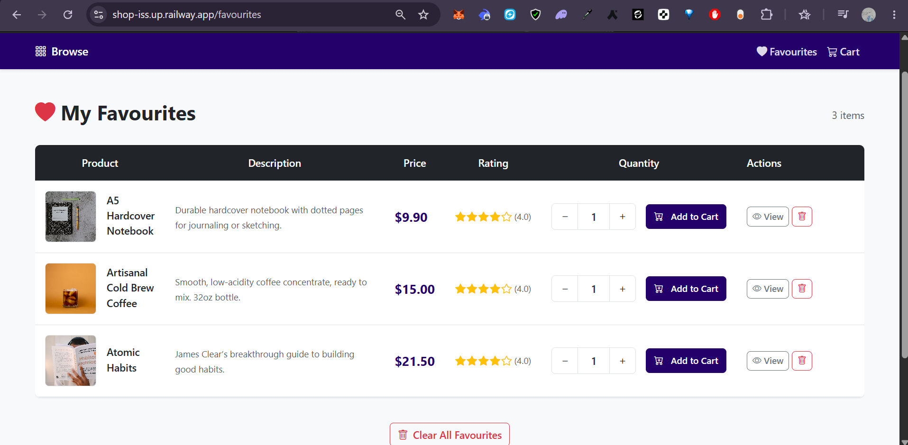
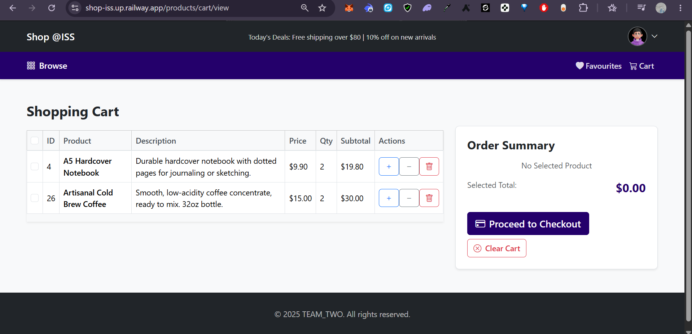
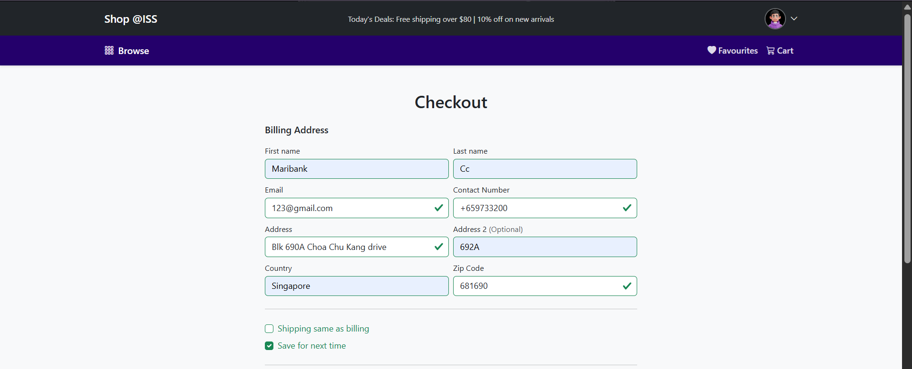
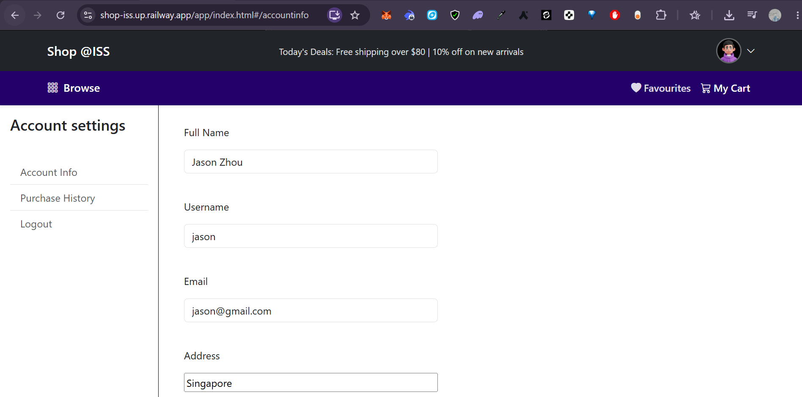

<div align="center">

# Shop @ISS

### Full-Stack E-Commerce Shopping Cart Application

[](https://openjdk.org/)
[](https://spring.io/projects/spring-boot)
[](https://react.dev/)
[](https://www.mysql.com/)
[](https://getbootstrap.com/)

A production-style e-commerce platform featuring product catalogue browsing, shopping cart management, order processing, customer reviews, and a favourites/wishlist system, built with a layered MVC architecture and server-side rendering.

[Features](#features) · [Tech Stack](#tech-stack) · [Screenshots](#screenshots) · [Railway Deployment](#railway-deployment) · [Getting Started](#getting-started) · [API Reference](#api-reference) · [Database Schema](#database-schema) · [My Contribution](#my-contribution--favouriteswishlist-feature)

</div>

---

## Screenshots

### Local Development

These screenshots were captured from the original localhost development setup while the feature work was being built and tested locally.

<table>
  <tr>
    <td align="center"><strong>Product Catalogue</strong></td>
    <td align="center"><strong>Product Details & Reviews</strong></td>
  </tr>
  <tr>
    <td></td>
    <td></td>
  </tr>
  <tr>
    <td align="center"><strong>Favourites / Wishlist</strong></td>
    <td align="center"><strong>Shopping Cart</strong></td>
  </tr>
  <tr>
    <td></td>
    <td></td>
  </tr>
  <tr>
    <td align="center"><strong>Login</strong></td>
    <td align="center"><strong>Checkout & Payment</strong></td>
  </tr>
  <tr>
    <td></td>
    <td></td>
  </tr>
</table>

### Railway Deployment

After validating the application locally, I containerized the full stack with Docker and deployed it on **Railway**. Railway is a cloud deployment platform that can build directly from a GitHub repository, run the application as a managed service, provide public networking, and attach managed databases such as MySQL through environment variables.

In this deployment, the Spring Boot backend serves the Thymeleaf pages and the compiled React assets from one Dockerized service. Railway provides the public application URL, health checks, automatic redeployments from the `main` branch, and a managed MySQL database for the deployed environment.

Live deployment:

```text
https://shop-iss.up.railway.app
```

<table>
  <tr>
    <td align="center"><strong>Railway Home / Product Catalogue</strong></td>
    <td align="center"><strong>Product Details</strong></td>
  </tr>
  <tr>
    <td></td>
    <td></td>
  </tr>
  <tr>
    <td align="center"><strong>Favourites / Wishlist</strong></td>
    <td align="center"><strong>Shopping Cart</strong></td>
  </tr>
  <tr>
    <td></td>
    <td></td>
  </tr>
  <tr>
    <td align="center"><strong>Checkout</strong></td>
    <td align="center"><strong>Account Profile</strong></td>
  </tr>
  <tr>
    <td></td>
    <td></td>
  </tr>
</table>

---

## Features

| Category | Capabilities |
|----------|-------------|
| **Product Catalogue** | Browse, keyword search, category filtering, multi-criteria sorting (name / price / rating), server-side pagination (10/page) |
| **Shopping Cart** | Add/remove items, quantity adjustment, automatic discount calculation, selective checkout |
| **Favourites / Wishlist** | Toggle favourite, view wishlist, bulk clear, post-login resume for unauthenticated users |
| **Orders & Payments** | Checkout flow, credit card entry, order confirmation, purchase history, per-item refund processing |
| **Reviews & Ratings** | Star ratings, written reviews (one per product per order), aggregated average rating |
| **User Accounts** | Registration, session-based authentication, profile management, password recovery |
| **Responsive UI** | Mobile, tablet, and desktop layouts powered by Bootstrap 5.3 |

---

## Tech Stack

| Layer | Technologies |
|-------|-------------|
| **Backend** | Java 17, Spring Boot 3.5.6, Spring MVC, Spring Data JPA (Hibernate), Thymeleaf, Maven |
| **Frontend** | React 19, React Router 7, React Bootstrap, Axios, Bootstrap Icons |
| **Database** | MySQL 8, Spring Session JDBC |
| **Deployment** | Docker, Railway, Railway MySQL, GitHub Actions |
| **Dev Tools** | Lombok, Spring Boot DevTools, H2 (testing) |

---

## Architecture

The application follows a **layered MVC + service architecture** with clear separation of concerns:

```
                    ┌─────────────────────────────────────────────┐
                    │              Client (Browser)               │
                    └──────────────────┬──────────────────────────┘
                                       │
                    ┌──────────────────▼──────────────────────────┐
                    │         Thymeleaf / React Frontend          │
                    └──────────────────┬──────────────────────────┘
                                       │ HTTP
         ┌─────────────────────────────▼───────────────────────────────┐
         │                    Controller Layer (9)                     │
         │  ProductController · FavouritesController · OrdersController│
         │  ShoppingCartDetailController · ReviewController · ...      │
         └─────────────────────────────┬───────────────────────────────┘
                                       │
         ┌─────────────────────────────▼───────────────────────────────┐
         │                     Service Layer (9)                       │
         │  Interface-driven design (FavouriteService → Impl)          │
         │  @Transactional business logic                              │
         └─────────────────────────────┬───────────────────────────────┘
                                       │
         ┌─────────────────────────────▼───────────────────────────────┐
         │                   Repository Layer (9)                      │
         │  Spring Data JPA · Custom JPQL queries · Composite keys     │
         └─────────────────────────────┬───────────────────────────────┘
                                       │
                    ┌──────────────────▼───────────────────────────┐
                    │              MySQL Database                  │
                    │          8 tables · 4 composite keys         │
                    └──────────────────────────────────────────────┘
```

### Project Structure

```
Shopping-Cart-Application/
├── pom.xml
├── src/main/java/com/Assignment/shopping_carts/
│   ├── Config/             # CORS, WebMvc configuration
│   ├── Controller/         # 9 controllers (MVC + REST)
│   ├── DTO/                # Data transfer objects
│   ├── Interceptor/        # Request logging
│   ├── InterfaceMethods/   # Service interfaces
│   ├── Model/              # 8 JPA entities + 4 composite keys
│   ├── Repository/         # Spring Data JPA repositories
│   └── Service/            # Service implementations
├── src/main/resources/
│   ├── application.properties
│   ├── templates/          # 11 Thymeleaf HTML templates
│   └── static/             # CSS, JS, images
└── shoppingcartfrontend/   # React SPA
    └── src/
        ├── components/     # Header, NavBar, Sidebar
        ├── pages/          # AccountInfo, PurchaseHistory, Register
        └── css/            # Frontend stylesheets
```

---

## Database Schema

8 JPA entities mapped to MySQL tables. Junction tables use `@IdClass` composite primary keys.

### Entity-Relationship Diagram

```
┌──────────────┐        ┌───────────────────────┐        ┌──────────────┐
│   Category   │ 1────* │       Product         │ *────1 │   Customer   │
├──────────────┤        ├───────────────────────┤        ├──────────────┤
│ categoryId PK│        │ productId PK          │        │ customerId PK│
│ name         │        │ productName NOT NULL  │        │ fullName     │
└──────────────┘        │ description (500)     │        │ userName     │
                        │ imageUrl              │        │ email        │
                        │ discount [0–1]        │        │ password     │
                        │ unitPrice [≥0]        │        │ address      │
                        │ averageRating         │        └──────┬───────┘
                        │ category_id FK        │               │
                        └──────┬────────────────┘               │
                               │                                │
             ┌─────────────────┼────────────────────────────────┤
             │                 │                                │
     ┌───────▼─────────┐ ┌─────▼────────────┐  ┌──────────────────▼─┐
     │  Favourites     │ │ ShoppingCart     │  │      Orders        │
     │  (junction)     │ │ Detail (junction)│  ├────────────────────┤
     ├──────────────── ┤ ├──────────────────┤  │ orderId PK         │
     │ productId PK/FK │ │ productId PK/FK  │  │ customerId FK      │
     │ customerId PK/FK│ │ customerId PK/FK │  │ purchaseDate       │
     └─────────────────┘ │ quantity         │  │ unitAmount         │
                         └──────────────────┘  │ status             │
                                               └────────┬───────────┘
                                                     │
                                        ┌────────────┼────────────┐
                                        │                         │
                                ┌───────▼────────┐      ┌────────▼────────┐
                                │  OrderDetail   │      │     Review      │
                                │  (junction)    │      │   (junction)    │
                                ├────────────────┤      ├─────────────────┤
                                │ orderId PK/FK  │      │ productId PK/FK │
                                │ productId PK/FK│      │ customerId PK/FK│
                                │ quantity       │      │ orderId PK/FK   │
                                │ isRefunded     │      │ rating          │
                                └────────────────┘      │ description     │
                                                        └─────────────────┘
```

### Table Definitions

<details>
<summary><strong>category</strong></summary>

| Column | Type | Constraints |
|--------|------|-------------|
| category_id | INT | PK, AUTO_INCREMENT |
| name | VARCHAR | |

</details>

<details>
<summary><strong>customer</strong></summary>

| Column | Type | Constraints |
|--------|------|-------------|
| customer_id | INT | PK, AUTO_INCREMENT |
| full_name | VARCHAR | |
| user_name | VARCHAR | |
| email | VARCHAR | |
| password | VARCHAR | |
| address | VARCHAR | |

</details>

<details>
<summary><strong>product</strong></summary>

| Column | Type | Constraints |
|--------|------|-------------|
| product_id | INT | PK, AUTO_INCREMENT |
| product_name | VARCHAR | NOT NULL |
| description | VARCHAR(500) | |
| image_url | VARCHAR | |
| discount | DOUBLE | CHECK (0 <= val <= 1) |
| unit_price | DOUBLE | CHECK (val >= 0) |
| average_rating | DOUBLE | |
| category_id | INT | FK -> category |

</details>

<details>
<summary><strong>orders</strong></summary>

| Column | Type | Constraints |
|--------|------|-------------|
| order_id | INT | PK, AUTO_INCREMENT |
| customer_id | INT | FK -> customer |
| purchase_date | DATE | |
| unit_amount | DOUBLE | |
| status | VARCHAR | |

</details>

<details>
<summary><strong>order_detail</strong> — composite PK (order_id, product_id)</summary>

| Column | Type | Constraints |
|--------|------|-------------|
| order_id | INT | PK, FK -> orders |
| product_id | INT | PK, FK -> product |
| quantity | INT | |
| is_refunded | BOOLEAN | |

</details>

<details>
<summary><strong>shopping_cart_detail</strong> — composite PK (product_id, customer_id)</summary>

| Column | Type | Constraints |
|--------|------|-------------|
| product_id | INT | PK, FK -> product |
| customer_id | INT | PK, FK -> customer |
| quantity | INT | |

</details>

<details>
<summary><strong>favourites</strong> — composite PK (product_id, customer_id)</summary>

| Column | Type | Constraints |
|--------|------|-------------|
| product_id | INT | PK, FK -> product |
| customer_id | INT | PK, FK -> customer |

</details>

<details>
<summary><strong>review</strong> — composite PK (product_id, customer_id, order_id)</summary>

| Column | Type | Constraints |
|--------|------|-------------|
| product_id | INT | PK, FK -> product |
| customer_id | INT | PK, FK -> customer |
| order_id | INT | PK, FK -> orders |
| rating | INT | |
| description | VARCHAR | |

> UNIQUE constraint on `(product_id, customer_id, order_id)` ensures one review per product per customer per order.

</details>

---

## API Reference

<details>
<summary><strong>Products</strong> — 3 endpoints</summary>

| Method | Endpoint | Description |
|--------|----------|-------------|
| GET | `/products` | List all products (pagination, filtering, sorting) |
| GET | `/products/details/{id}` | Product detail page with reviews |
| GET | `/products/cart/add` | Add product to cart |

</details>

<details>
<summary><strong>Cart</strong> — 9 endpoints</summary>

| Method | Endpoint | Description |
|--------|----------|-------------|
| POST | `/products/cart/add` | Add product to cart |
| GET | `/products/cart/view` | View cart contents |
| POST | `/products/cart/plus` | Increment item quantity |
| POST | `/products/cart/minus` | Decrement item quantity |
| POST | `/products/cart/select` | Toggle item selection |
| POST | `/products/cart/remove` | Remove item from cart |
| POST | `/products/cart/clear` | Clear all items |
| POST | `/products/cart/payment` | Proceed to payment |
| POST | `/products/cart/checkout` | Complete purchase |

</details>

<details>
<summary><strong>Favourites</strong> — 7 endpoints</summary>

| Method | Endpoint | Description |
|--------|----------|-------------|
| GET | `/favourites` | View all favourited products |
| POST | `/favourites/save` | Toggle favourite (add/remove) |
| GET | `/favourites/customer` | Get favourites for logged-in customer |
| POST | `/favourites/clear` | Remove all favourites |
| POST | `/favourites/remove-product` | Remove a single favourite |
| GET | `/favourites/status/{productId}` | Check if product is favourited |
| GET | `/favourites/resume` | Resume pending favourite after login |

</details>

<details>
<summary><strong>Orders</strong> — 2 endpoints</summary>

| Method | Endpoint | Description |
|--------|----------|-------------|
| GET | `/api/purchaseHistory/customer` | Get order history |
| POST | `/api/purchaseHistory/refund/{order_id}/{product_id}` | Process refund |

</details>

<details>
<summary><strong>Reviews</strong> — 3 endpoints</summary>

| Method | Endpoint | Description |
|--------|----------|-------------|
| POST | `/api/reviews/add/{productId}/{customerId}/{orderId}` | Add review |
| GET | `/api/reviews/product/{productId}` | Get product reviews |
| GET | `/api/reviews/product/{productId}/average-rating` | Get average rating |

</details>

<details>
<summary><strong>Auth & Account</strong> — 8 endpoints</summary>

| Method | Endpoint | Description |
|--------|----------|-------------|
| GET | `/login` | Login page |
| POST | `/login/try` | Authenticate |
| GET | `/login/logout` | Logout |
| POST | `/login/forgetPassword` | Reset password |
| POST | `/api/register` | Register account |
| GET | `/api/register/check/{userName}` | Check username availability |
| GET | `/api/account-info` | Get account info |
| POST | `/api/account-info/save` | Update account info |

</details>

---

## Getting Started

### Prerequisites

| Tool | Version |
|------|---------|
| Java | 17+ |
| Maven | 3.8+ |
| MySQL | 8.0+ |
| Node.js | 18+ |

### Installation

```bash
# 1. Clone the repository
git clone <repository-url>
cd Shopping-Cart-Application

# 2. Create the database
mysql -u root -p -e "CREATE DATABASE tst;"

# 3. Configure credentials (src/main/resources/application.properties)
#    spring.datasource.url=jdbc:mysql://localhost:3306/tst
#    spring.datasource.username=root
#    spring.datasource.password=root

# 4. Start the backend (http://localhost:8080)
mvn spring-boot:run

# 5. Start the frontend (http://localhost:3000)
cd shoppingcartfrontend && npm install && npm start
```

### Test Accounts

| Username | Password |
|----------|----------|
| `jason` | `1234` |
| `glenn` | `abcd` |
| `alice` | `5678` |

---

## My Contribution — Favourites/Wishlist Feature

I owned the **Favourites/Wishlist use case end-to-end**, delivering the feature across all layers of the application stack:

### What I Built

| Layer | Work Done |
|-------|-----------|
| **Entity & Data Model** | Designed the `Favourites` JPA entity with `@IdClass(FavouritesId)` composite primary key modelling the many-to-many relationship between `Customer` and `Product` |
| **Repository** | Wrote custom JPQL queries for fetching favourite products, existence checks, deletion, and count aggregation |
| **Service** | Implemented `@Transactional` business logic with toggle behaviour — a single method that adds if not favourited, removes if already favourited |
| **Controller** | Built 7 REST/MVC endpoints under `/favourites` for view, toggle, bulk clear, single remove, status check, and post-login resume |
| **Frontend** | Created the `favourites.html` Thymeleaf template with responsive product table, quantity selectors, add-to-cart, and remove actions; integrated heart icon toggle on product detail pages with real-time status via `/favourites/status/{id}` |
| **Styling** | Authored `favourites.css` for the wishlist page layout |

### Files Authored (8 files)

```
Model/Favourites.java                    # JPA entity
Model/compositeKey/FavouritesId.java     # Composite primary key
Repository/FavouritesRepository.java     # Data access + JPQL queries
InterfaceMethods/FavouriteService.java   # Service interface (7 methods)
Service/FavouriteServiceImpl.java        # Business logic implementation
Controller/FavouritesController.java     # 7 endpoints
templates/favourites.html                # Wishlist UI
static/css/favourites.css                # Page styling
```

---

## Credits

Built by **Team Two** @ NUS-ISS
