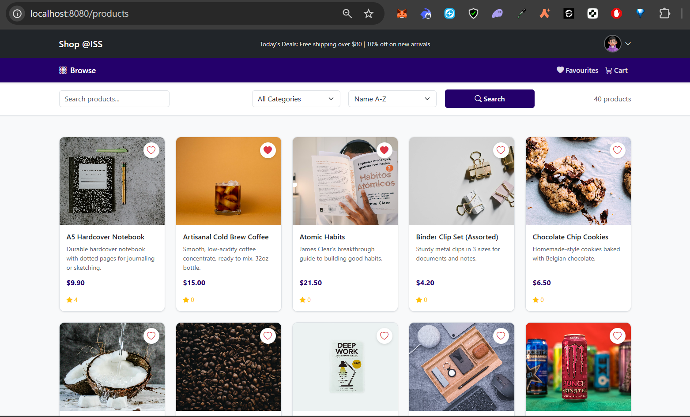
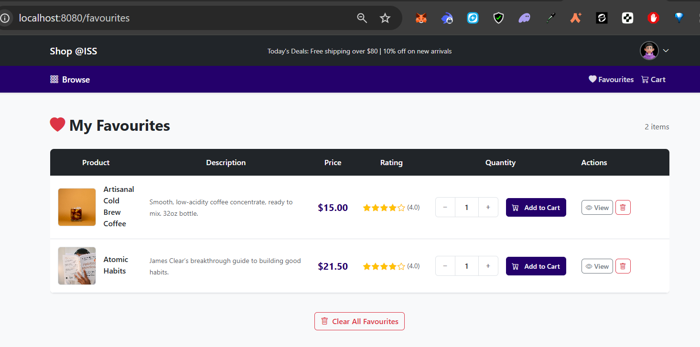
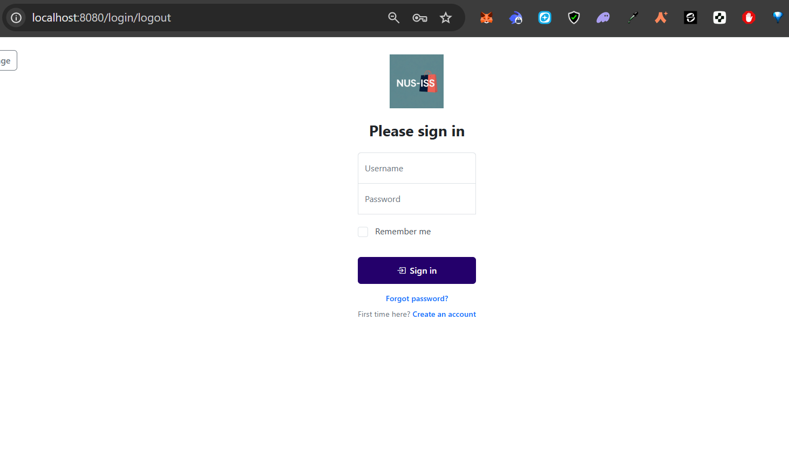

# Shop @ISS — E-Commerce Shopping Cart

Full-stack e-commerce web application built with Spring Boot and React.

---

## Screenshots

| Product Catalog | Product Details |
|:---:|:---:|
|  |  |

| Shopping Cart | Favourites |
|:---:|:---:|
|  |  |

| Payment Confirmation | Sign In |
|:---:|:---:|
|  |  |

---

## Features

- Product browsing with search, category filtering, sorting (name/price/rating), and pagination
- Shopping cart with quantity management, discount calculation, and selective checkout
- User authentication with session management
- Order history and refund processing
- Product reviews and star ratings
- Favourites / wishlist
- Account management (profile editing, password recovery)
- Responsive design (mobile, tablet, desktop)

---

## Tech Stack

| Layer | Technologies |
|---|---|
| **Backend** | Java 17, Spring Boot 3.5.6, Spring Data JPA, Thymeleaf, Maven |
| **Frontend** | React 19, React Router, React Bootstrap, Axios |
| **Database** | MySQL 8, Spring Session JDBC |
| **Styling** | Bootstrap 5.3, Bootstrap Icons |

---

## Architecture Overview

The application follows an MVC + service-layer architecture: **Controller → Service → Repository**.

- **9 Controllers** — ProductController, ShoppingCartDetailController, OrdersController, FavouritesController, ReviewController, LogController, RegisterController, AccountInfoController, CategoryController
- **9 Services** — Business logic implementations for each domain
- **9 Repositories** — Spring Data JPA interfaces (including CustomerRepository and OrderDetailRepository)
- **8 Entities** — Product, Customer, Category, ShoppingCartDetail, Orders, OrderDetail, Review, Favourites (with composite key support via `@IdClass`)

---

## Getting Started

### Prerequisites

- Java 17+
- Maven
- MySQL 8
- Node.js + npm

### 1. Clone the repository

```bash
git clone <repository-url>
cd Shopping-Cart-Application
```

### 2. Create the MySQL database

```sql
CREATE DATABASE tst;
```

### 3. Configure database credentials

Update `src/main/resources/application.properties` with your MySQL username and password:

```properties
spring.datasource.url=jdbc:mysql://localhost:3306/tst
spring.datasource.username=root
spring.datasource.password=root
```

### 4. Run the backend

```bash
mvn spring-boot:run
```

The backend will start at **http://localhost:8080**.

### 5. Run the frontend

```bash
cd shoppingcartfrontend
npm install
npm start
```

The React frontend will start at **http://localhost:3000**.

### 6. Test accounts

| Username | Password |
|---|---|
| `jason` | `1234` |
| `glenn` | `abcd` |
| `alice` | `5678` |

---

## API Endpoints

### Products

| Method | Endpoint | Description |
|---|---|---|
| GET | `/products` | List all products (pagination, filtering, sorting) |
| GET | `/products/details/{id}` | Product detail with reviews |
| GET | `/products/cart/add` | Add product to cart |

### Cart

| Method | Endpoint | Description |
|---|---|---|
| POST | `/products/cart/add` | Add product to cart |
| GET | `/products/cart/view` | View cart contents |
| POST | `/products/cart/plus` | Increment item quantity |
| POST | `/products/cart/minus` | Decrement item quantity |
| POST | `/products/cart/select` | Toggle item selection |
| POST | `/products/cart/remove` | Remove item from cart |
| POST | `/products/cart/clear` | Clear all items |
| POST | `/products/cart/payment` | Proceed to payment |
| POST | `/products/cart/checkout` | Complete purchase |

### Orders

| Method | Endpoint | Description |
|---|---|---|
| GET | `/api/purchaseHistory/customer` | Get order history |
| POST | `/api/purchaseHistory/refund/{order_id}/{product_id}` | Process refund |

### Reviews

| Method | Endpoint | Description |
|---|---|---|
| POST | `/api/reviews/add/{productId}/{customerId}/{orderId}` | Add review |
| GET | `/api/reviews/product/{productId}` | Get product reviews |
| GET | `/api/reviews/product/{productId}/average-rating` | Get average rating |

### Favourites

| Method | Endpoint | Description |
|---|---|---|
| GET | `/favourites` | List favourites |
| POST | `/favourites/save` | Toggle favourite |
| POST | `/favourites/remove-product` | Remove favourite |
| GET | `/favourites/status/{productId}` | Check favourite status |
| POST | `/favourites/clear` | Clear all favourites |

### Auth & Account

| Method | Endpoint | Description |
|---|---|---|
| GET | `/login` | Login page |
| POST | `/login/try` | Authenticate |
| GET | `/login/logout` | Logout |
| POST | `/login/forgetPassword` | Reset password |
| POST | `/api/register` | Register account |
| GET | `/api/register/check/{userName}` | Check username availability |
| GET | `/api/account-info` | Get account info |
| POST | `/api/account-info/save` | Update account info |

---

## Project Structure

```
Shopping-Cart-Application/
├── pom.xml
├── src/main/java/com/Assignment/shopping_carts/
│   ├── Controller/          # 9 controllers (MVC + REST)
│   ├── Service/             # 9 service implementations
│   ├── Repository/          # 9 JPA repository interfaces
│   ├── Model/               # 8 entity classes
│   ├── DTO/                 # CustomerRegisterDTO
│   └── Config/              # CorsConfig, WebAppConfig
├── src/main/resources/
│   ├── application.properties
│   ├── templates/           # Thymeleaf views
│   │   ├── displayProducts.html
│   │   ├── detailsProducts.html
│   │   ├── shoppingCart.html
│   │   ├── checkout.html
│   │   ├── creditCardDetails.html
│   │   ├── favourites.html
│   │   ├── settings.html
│   │   ├── login.html
│   │   ├── login_error.html
│   │   ├── createAccount.html
│   │   └── forgetPassword.html
│   └── static/
│       ├── css/             # Page-specific stylesheets
│       └── images/          # Screenshots and assets
└── shoppingcartfrontend/    # React SPA
    └── src/
        ├── components/      # Header, NavBar, Sidebar, Favourites
        ├── pages/           # AccountInfo, PurchaseHistory, Register
        └── css/             # Frontend stylesheets
```

---

<details>
<summary>Design System</summary>

### Color Palette

| Role | Hex | Description |
|---|---|---|
| Primary | `#0d6efd` | Bootstrap Blue |
| Secondary | `#6c757d` | Gray |
| Dark Background | `#212529` | Dark gray / black tone |
| Light Background | `#f8f9fa` | Soft white |
| Success | `#198754` | Green |
| Danger | `#dc3545` | Red |
| Warning | `#ffc107` | Yellow |

### Static Assets

```
static/
├── css/
│   ├── style.css              # Global styles
│   ├── cart.css
│   ├── checkout.css
│   ├── detailsProducts.css
│   ├── displayProducts.css
│   ├── favourites.css
│   ├── login.css
│   └── settings.css
└── images/
    ├── shop-logo.png
    └── placeholder.png
```

</details>

---

## Credits

Built by **Team Two** @ NUS-ISS
